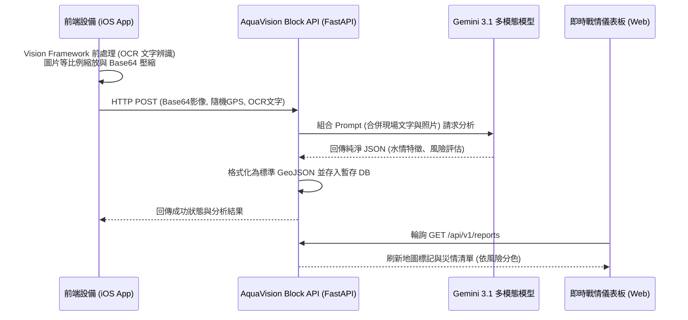

# AquaVision Block (水情視覺解析元件)


> **2026 數位發展部 防災積木元件創新賽 參賽作品**

https://github.com/user-attachments/assets/c6268f6b-4df0-4631-8ffb-10d0697c7400

## 📌 元件基本資訊
* **元件實作型態：** API 服務型元件 (Service Component) + 視覺化戰情模組
* **聚焦災情情境：** 2025 年 9 月花蓮馬太鞍溪堰塞湖災害事件
* **核心聚焦功能：** 通報 (Call) & AI 影像多模態應用

---

## 1. 元件之功能定位與欲解決問題之說明

### 🚨 待解決問題
在花蓮馬太鞍溪堰塞湖危機中，前線巡守人員或民眾回報災情常依賴通訊軟體（如 LINE、Telegram）傳送照片與簡短文字。這些**非結構化資料**需要災防中心耗費大量人力進行人工判讀，且容易漏掉關鍵資訊（如環境中的水尺刻度、電線桿標號、水體混濁度變化），導致決策延遲與資源錯置。

### 💡 解法與功能定位
**AquaVision Block** 是一個「隨插即用」的視覺解析 API 元件。其功能定位為**「非結構化影像通報與災防決策系統之間的轉譯器」**。
透過本次實作的 MVP，我們達成了：
1. **邊雲協同運算 (Edge-Cloud AI)：** 利用前端設備（iOS 原生 Vision Framework）進行離線 OCR 初步特徵提取，再結合照片 Base64 壓縮直傳給雲端 **Gemini 3.1** 進行深度多模態推論。
2. **結構化標準輸出：** 自動擷取影像中的關鍵數據（如積水深度、水體混濁狀態、風險等級），轉換為機器可讀的標準化 GeoJSON 格式。
3. **即時戰情儀表板：** 內建基於 Leaflet.js 的戰情地圖，無縫對接決策儀表板，依風險等級自動標記紅/橘/綠燈，方便指揮中心第一時間調派資源。

---

## 2. 使用流程與系統架構圖

本元件採用「邊緣與雲端協作」架構，極大化發揮手機端算力，並結合最新大語言模型的視覺分析能力。



---

## 3. 核心技術亮點

* **雙重判斷機制**：將「邊緣端 OCR 結果」作為 Prompt 餵給「雲端大模型」，解決反光或模糊導致純視覺模型誤判的問題。
* **高效傳輸設計**：在 iOS 端實作了等比例縮放與 JPEG 壓縮，將 Base64 封包控制在極小體積，適應災區惡劣網路環境。
* **強制 JSON 輸出結構**：利用 LLM 的 `response_mime_type="application/json"`，確保大模型輸出的資料 100% 可被系統程式解析，杜絕幻覺與廢話。
* **真實地理視覺化**：採用隨機偏移演算法模擬馬太鞍濕地周邊的真實通報點位，並實作點擊連動 (`flyTo`) 的戰情地圖。

---

## 4. 如何啟動與測試 (Quick Start)

### 啟動後端 API 與戰情室
請確保環境已安裝 `fastapi`, `uvicorn`, `pydantic`, `google-generativeai`，並已設定 `GEMINI_API_KEY` 環境變數。
```bash
# 啟動 FastAPI 伺服器
python -m uvicorn main:app --host 0.0.0.0 --port 8000 --reload
```
啟動後，請使用瀏覽器開啟戰情室儀表板：👉 **[http://127.0.0.1:8000/dashboard](http://127.0.0.1:8000/dashboard)**

### iOS 端通報測試
1. 在 Xcode 中編譯並執行 `AquaVisionClient` App (可使用模擬器或實機)。
2. 從相簿選取一張災情照片（例如淹水、溪水暴漲的照片）。
3. 點擊 **「開始邊緣辨識並通報」**。
4. 觀察電腦端的**戰情室儀表板**，地圖將會在數秒內自動彈出對應的災情標記，並列出 AI 解析的嚴重程度！
